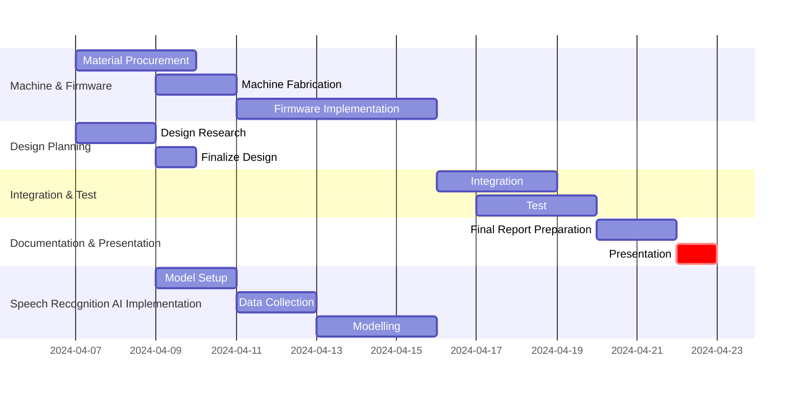

# Project Name: EcoSort 

>Sound recognition-based rubbish sorting system for recycling

EcoSort is an innovative project that utilizes advanced sound recognition technology to develop an efficient automatic waste sorting system. This system identifies and categorizes waste into plastic, metal, or paper by recognizing the sounds produced when trash is thrown and hits the top of the bin.

By combining cutting-edge technology for environmental protection, this project enhances the efficiency and convenience of waste management. Waste sorting is often neglected by many, so EcoSort aims to address this issue by using sound recognition technology to automatically sort waste. This not only raises environmental awareness but also optimizes the waste disposal process.

> Demonstration Video Link 👇

* [Demonstration Video click](https://youtube.com/shorts/WwXuutiFc3Y?si=UxoZxxDrEbfMhST1)

> Presentation Link 👇

* [Presentation ppt click](https://www.canva.com/design/DAGB4bD7V8c/_7ljApcovK_1GcbWy087zg/edit?utm_content=DAGB4bD7V8c&utm_campaign=designshare&utm_medium=link2&utm_source=sharebutton)

> Github 링크 👇

* [Github click](https://github.com/CodeMystero/soundRecognitionRecycleBin)

## Project Summary
* Members
  | Name | Role |
  |----|----|
  | Seunghwan Kim | Project lead |
  | Intae Song | Embedded system |
  | Yongcheol Kim | AI modeling |
  | Junyoung Kim | AI modeling |
  

## Project Milestone- Gantt Chart

## High Level Design

<빌드>
otx build --train-data-roots ./images/augmented_data_2~10pcs_2k --model EfficientNet-V2-S --workspace ./augmented_audio1
#model : EfficientNet-V2-S

<학습>
otx train
- 커스텀마이징 : otx train params --learning_parameters.num_iters 8\ --learing_parameters.batch_size 1

<검증>
otx eval --test-data-roots ./splitted_dataset/val --load-weight ./outputs/latest_trained_model/logs/best_epoch_16.pth

<확장>
otx export --load-weight ./outputs/20240403_154732_train/models/weights.pth --output ./outputs/model/
- 학습 모델 내보내기 -> openvino.xml , openvino.bin 생성됨

otx optimzie --load-weights ./outputs/latest_trained_model/

<배포>
otx deploy --load-weight ./outputs/model/openvino.xml --output ./outputs/model/
- 학습 모델 배포 -> openvino.zip 생성 -> 압축 풀면 python 폴더 생기고 demo.py 생성됨. 

<실행코드>
python3 demo.py --input /home/jy/workspace/dogscats/cats/cat.1094.jpg --models ../model --output resulted_images
- demo.py를 활용해 테스트 실행.
